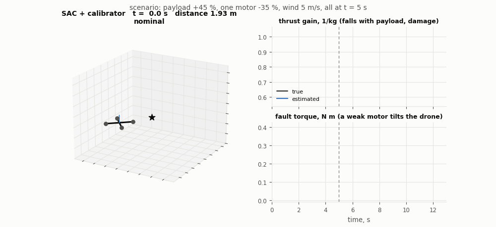
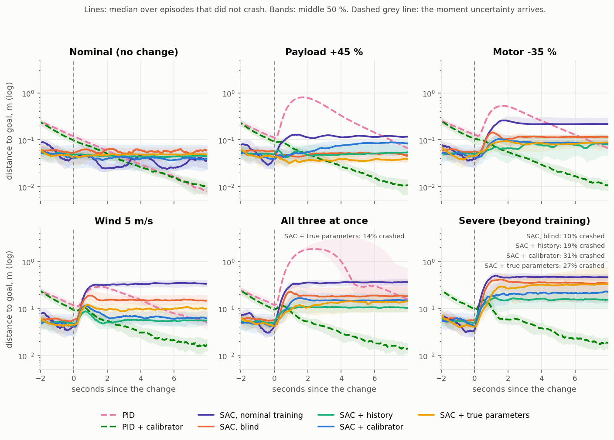
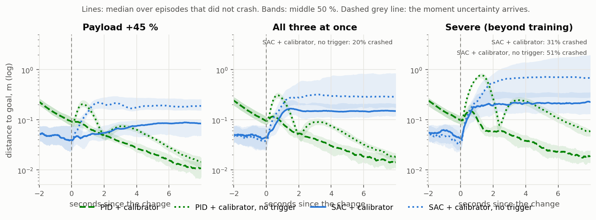
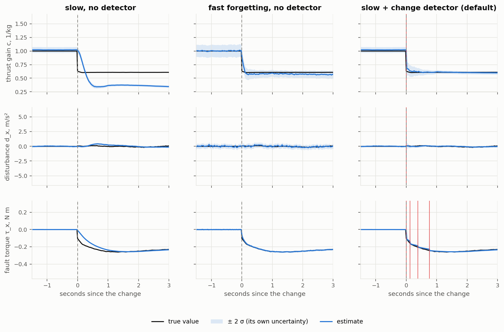

# Self-Calibrating Drone

A quadrotor that notices when its model of itself stops fitting (a payload is picked up, a
motor is damaged, the wind rises), re-measures itself within a fraction of a second, and
keeps flying.

The project pairs an **online calibrator** with a flight controller:

* a **Kalman-filter estimator** tracks three quantities the controller is never told: the
  thrust gain *c* (mass and motor health), an external force *d* (wind) and a fault torque
  *τ* (an uneven motor);
* a **CUSUM change detector** watches the estimator's prediction errors. When they stop
  looking like noise, it resets the filter's uncertainty, and the estimates snap to the
  new values within a few tenths of a second;
* the estimates feed either a **classical cascaded PID** (as feed-forward) or a
  **Soft Actor-Critic (SAC)** agent (as extra observations).

Everything is written from scratch in NumPy and PyTorch: the rigid-body simulator, the
estimator, the detector and SAC. No simulator or RL library is needed, and a GPU is
optional.



## Quick start

Requires Python 3.10 to 3.13 (PyTorch has no package for 3.14 yet).

```bash
git clone https://github.com/Basar-mte/Self-Calibrating-Drone.git
cd Self-Calibrating-Drone
pip install -r requirements.txt

python tests/test_env.py          # 8 sanity checks, about 10 s
python demo.py                    # pretrained agent flies through the combined fault
python demo.py --pid              # the classical controller with the calibrator
python calibration_study.py       # the estimator on its own: slow vs fast vs triggered
```

Pretrained agents are included under `results/sac_*/best.pt`, so the demo and the
evaluation run without training.

## Reproducing the results

```bash
bash run_all.sh                                           # 12 training runs, about 3 h on a laptop GPU
python evaluate.py --runs "results/sac_*_s*" --pid --episodes 100
python make_figures.py                                    # writes results/figures/
```

## Results

Every controller flies the same 100 drones per scenario. The drone hovers at its goal, and
at **t = 5 s** something changes without warning:

| scenario | what happens at t = 5 s |
|---|---|
| nominal | nothing |
| payload | mass +45 % |
| motor_fault | one motor loses 35 % of its thrust |
| wind_gust | wind rises from calm to 5 m/s, gusting |
| combined | all three at once |
| severe | beyond the training range: mass +55 %, one motor −45 %, wind 7 m/s |

**Success** means the drone did not crash and its mean distance from the goal over the
last 2 s was below 0.3 m. SAC rows are the mean over training seeds (3 seeds, except
*true parameters* with 2 and *nominal training* with 1).

**Success rate**

| controller | nominal | payload | motor fault | wind gust | combined | severe |
|---|---|---|---|---|---|---|
| PID | 1.00 | 1.00 | 1.00 | 1.00 | 0.55 | 0.00 |
| **PID + calibrator** | **1.00** | **1.00** | **1.00** | **1.00** | **1.00** | **1.00** |
| PID + calibrator, no trigger | 1.00 | 1.00 | 1.00 | 1.00 | 1.00 | 1.00 |
| SAC, nominal training | 1.00 | 1.00 | 0.79 | 0.32 | 0.24 | 0.08 |
| SAC, blind | 1.00 | 1.00 | 1.00 | 1.00 | 0.77 | 0.40 |
| SAC + history | 1.00 | 1.00 | 1.00 | 1.00 | 0.95 | 0.66 |
| SAC + true parameters | 1.00 | 1.00 | 1.00 | 1.00 | 0.78 | 0.34 |
| SAC + calibrator | 1.00 | 1.00 | 0.96 | 1.00 | 0.85 | 0.48 |
| SAC + calibrator, no trigger | 1.00 | 0.84 | 1.00 | 0.99 | 0.42 | 0.13 |

**RMS distance from the goal after the change (m)**, over flights that did not crash

| controller | nominal | payload | motor fault | wind gust | combined | severe |
|---|---|---|---|---|---|---|
| PID | 0.052 | 0.429 | 0.292 | 0.171 | 1.598 | all crashed |
| **PID + calibrator** | **0.044** | **0.044** | **0.048** | **0.052** | **0.052** | **0.064** |
| PID + calibrator, no trigger | 0.044 | 0.084 | 0.070 | 0.060 | 0.114 | 0.297 |
| SAC + history | 0.046 | 0.057 | 0.081 | 0.060 | 0.125 | 0.237 |
| SAC + calibrator | 0.048 | 0.071 | 0.104 | 0.080 | 0.306 | 0.326 |
| SAC, blind | 0.055 | 0.052 | 0.110 | 0.160 | 0.223 | 0.396 |

Full tables, including crash rates, settling times and the spread between seeds, are in
[results/eval/summary.csv](results/eval/summary.csv).

### What this shows

* **The calibrator makes the classical controller robust.** PID + calibrator holds the
  goal within about 4 to 6 cm (RMS) in every scenario, including *severe*, which is outside anything
  the system was designed for. The same PID without the calibrator sinks, drifts, and
  crashes every time in *severe*.
* **The change detector matters.** Without it the estimator adapts too slowly: PID's error
  after the change grows up to 4.6×, and the SAC agent's success in *combined* drops from
  0.85 to 0.42.
* **For the learned controller the picture is mixed.** SAC + calibrator beats the blind
  agent in *combined* and *severe*, but **SAC + history**, which sees only its recent raw
  sensor readings, does better still. SAC + calibrator also crashes more often than the
  blind agent in *severe* (31 % vs 10 %). Even the agent given the exact true parameters
  does not beat history. So the limiting factor for SAC here is how well the policy learns
  to use the extra inputs, not the quality of the estimates.
* **Seeds vary a lot in the hard scenarios** (success standard deviation up to 0.33 across
  3 seeds), so the SAC rankings in *combined* and *severe* are not settled by this many
  seeds.





### The estimator on its own

`calibration_study.py` flies 100 drones through the combined fault and measures how fast
the estimates converge:

| estimator | median time until both estimates converge | flights that never converged |
|---|---|---|
| slow filter, no detector | never (thrust gain) | 100 % |
| fast-forgetting filter, no detector | 7.96 s | 43 % |
| **slow filter + change detector** | **0.68 s** (90th percentile 0.76 s) | **0 %** |

The detector raised no false alarms in nominal flight.



## Repository layout

```
drone_cal/              the package
  dynamics.py             quadrotor physics: rotations, motors, mixer, rate loop
  calibrator.py           Kalman estimator + CUSUM change detector
  scenarios.py            training randomisation and the six test scenarios
  env.py                  batched environment the controllers fly in
  pid.py                  classical cascaded controller
  sac.py                  Soft Actor-Critic (networks, replay buffer, CUDA graph)
  evaluation.py           rollouts and metrics
  viz.py                  figures and the GIF
  utils.py                config, seeding, logging
configs/default.yaml    every setting, documented in docs/04
train.py                train one SAC agent
evaluate.py             fly every controller through every scenario
calibration_study.py    test the estimator on its own
demo.py                 one flight, with plot and GIF
make_figures.py         every figure in this README
plot_training.py        training curves
run_all.sh              train all 12 agents in the comparison
tests/test_env.py       sanity checks
docs/                   step-by-step documentation
results/
  sac_<agent>_s<seed>/    trained agents (best.pt, config, logs)
  eval/                   evaluation tables
  figures/                figures used here
  calibration/            calibration study
```

## Documentation

1. [The ideas, in plain words](docs/01_concepts.md): how a drone flies, what goes wrong,
   how the calibrator and the detector work, SAC in brief
2. [Setting up and running](docs/02_setup.md): install, commands, timings, common problems
3. [Code walkthrough](docs/03_code_walkthrough.md): every file, in reading order
4. [Configuration reference](docs/04_config_reference.md): every setting in `configs/default.yaml`
5. [Glossary](docs/05_glossary.md)

## Author

Md. Abul Basar Roky ([@Basar-mte](https://github.com/Basar-mte))
